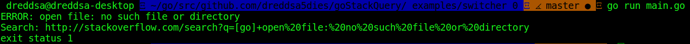
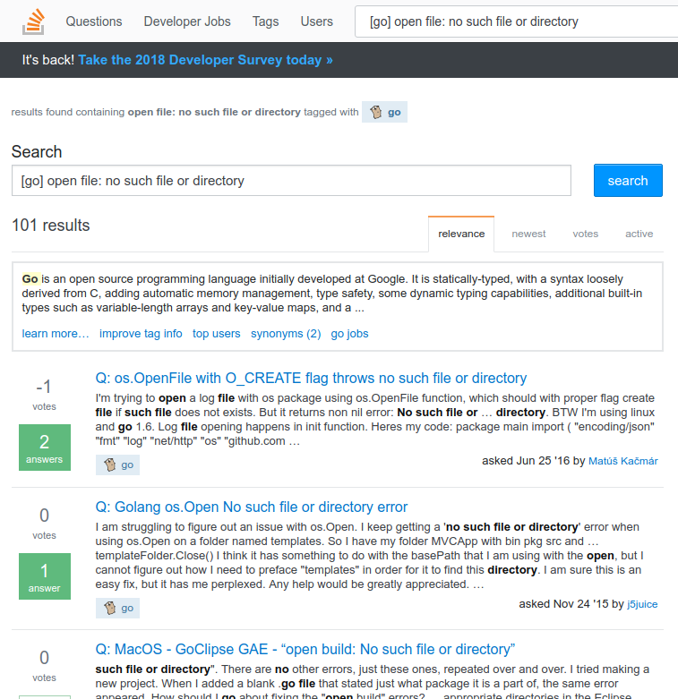

[](https://travis-ci.org/dreddsa5dies/goStackQuery) [](https://goreportcard.com/report/github.com/dreddsa5dies/goStackQuery) [](https://godoc.org/github.com/dreddsa5dies/goStackQuery) [](https://circleci.com/gh/dreddsa5dies/goStackQuery)  [](https://codecov.io/gh/dreddsa5dies/goStackQuery)  


### Go (golang) package for search error on [Stackoverflow](https://stackoverflow.com)

## Install

```bash
go get -v github.com/dreddsa5dies/goStackQuery
```

## Example
Examples of use, see [examples](https://github.com/dreddsa5dies/goStackQuery/tree/master/_examples)

```Go
package main

import (
	"fmt"
	"os"

	goStackQuery "github.com/dreddsa5dies/goStackQuery"
)

func main() {
	// TODO EXAMPLE
}
```

## Switchers:
0 - Query ERROR and paste link on STDERR  
  
1 - Query ERROR on web browser and automate open link  


## The code contains comments in Russian

## License
This project is licensed under MIT license. Please read the LICENSE file.

## Contribute
Welcomes any kind of contribution. Please read the CONTRIBUTING and CODE_OF_CONDUCT file.